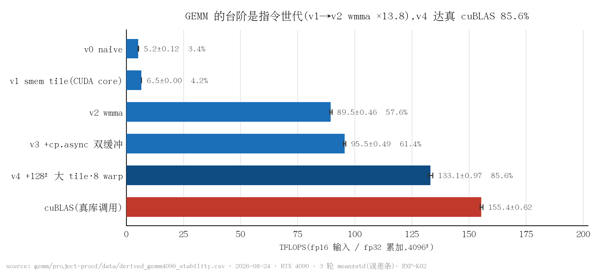
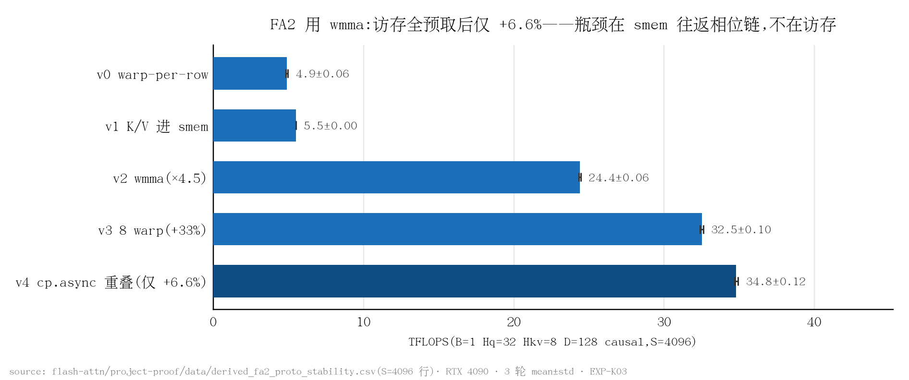
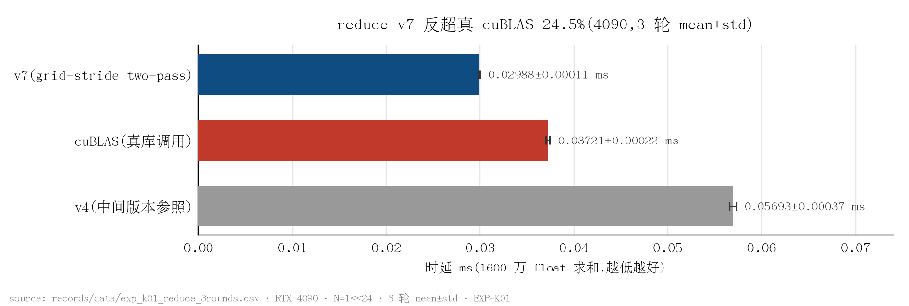
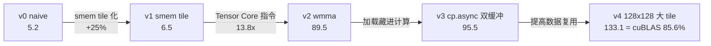

# Kernel_Optimazation

*手写 CUDA kernel 版本梯:六个算子,从 naive 到打平或反超通用库*

本项目考察手写 CUDA kernel 在什么条件下能赢过 cuBLAS / PyTorch,凭什么赢,又被哪一层机制限制。六个算子(reduce、softmax、gemv、int8 quantize、Tensor Core GEMM、FA2 forward)各自构成一条完整的优化版本梯:从 naive 实现逐级改进至打平或反超通用库,每一步提速可测量、可归因、可复现。测量显示,赢的三种形态(shape 特化、贴合硬件的极简结构、kernel 融合)与输的结构性原因(如 wmma 的架构税)都能落到具体机制上。方法论、逐项目拆解与跨项目规律见 [PORTFOLIO.md](PORTFOLIO.md)。

## 性能结果

测量均在 RTX 4090 上进行;凡未另注,数字为 3 轮 mean±std。

| 算子 | 结果 | 证据 |
|---|---|---|
| Tensor Core GEMM | **133.1±0.97 TFLOPS**,为真 cuBLAS 的 85.6%(4096³,fp16 输入 / fp32 累加;wmma + cp.async 双缓冲 + 128x128 tile) | [EXP-K02](records/EXP-K02_cuda_gemm_tc_ladder.md),`gemm/project-proof/data/derived_gemm4096_stability.csv` |
| FA2 forward | **34.8±0.12 TFLOPS**(S=4096,D=128,causal+GQA,全 shape 通过 2e-2 正确性 gate);为同协议 Triton 版的 28%(跨 harness,推断级),即 wmma 架构税的定量测量 | [EXP-K03](records/EXP-K03_cuda_fa2_ladder.md),`flash-attn/project-proof/data/derived_fa2_proto_stability.csv` |
| reduce | v7 反超真 cuBLAS **24.5%**(0.02988±0.00011 vs 0.03721±0.00022 ms,1600 万 float);端到端 347.6 ms 至 0.291 ms,约 1193x(4070 Laptop 口径) | [EXP-K01](records/EXP-K01_4090_rebench.md),`records/data/exp_k01_reduce_3rounds.csv` |
| gemv | v3 比真 cuBLAS gemv 快 **37.8%**(4096x2048;对照双方各 3 轮,单轮曾测得 84%,复测不成立,见测量方法) | [EXP-K01](records/EXP-K01_4090_rebench.md),`records/data/exp_k01_gemv_3rounds.csv` |
| int8 quantize | v4 **5.57±0.03 µs**(1024² per-channel symmetric);单 kernel 融合较 PyTorch eager 快 6.6x(4070 Laptop 口径,单轮) | [EXP-K01](records/EXP-K01_4090_rebench.md),`records/data/exp_k01_int8_quantize_3rounds.csv` |



*图 1:GEMM 的性能台阶来自指令世代(v1 至 v2 换 wmma,13.8x),访存微调只是坡(v0 至 v1 仅 +25%);v4 达真 cuBLAS 的 85.6%。(数据:`gemm/project-proof/data/derived_gemm4096_stability.csv`;脚本:`scripts/plot_readme_figures.py`)*



*图 2:同一套 wmma 工具箱,FA2 只到 34.8 TFLOPS;v4 把 K/V 访存全部预取重叠后仅 +6.6%,说明瓶颈在 shared memory 往返的相位链而非访存。(数据:`flash-attn/project-proof/data/derived_fa2_proto_stability.csv`;脚本:`scripts/plot_readme_figures.py`)*



*图 3:单一 shape 特化的 grid-stride two-pass(v7)反超真 cuBLAS 24.5%(3 轮,对照物经调用点验真)。(数据:`records/data/exp_k01_reduce_3rounds.csv`;脚本:`scripts/plot_readme_figures.py`)*

图表全部由脚本从原始数据生成(matplotlib):`python scripts/plot_readme_figures.py`。

## 关键发现

**性能台阶来自指令世代,而非访存微调。** GEMM 版本梯上,smem tile 化(v0 至 v1)只带来 +25%,换用 Tensor Core 指令(v1 至 v2,wmma)一步 13.8x。compute-bound 算子里访存微调只是坡,指令世代才是台阶;反过来,memory-bound 的 reduce / gemv 里指令层面的微调收益趋近于 0。应先判定算子是 memory-bound 还是 compute-bound,再选优化手段——错配的优化在错误的方向上没有回报。

**wmma 的架构税:同一套工具箱,GEMM 够到 86%,FA2 只够到 28%。** wmma accumulator fragment 的 lane 到元素的映射是编译器私有的,FA2 的行级 softmax(max/exp/rescale)无法直接在 fragment 上做——QK^T 结果必须 `store_matrix_sync` 落回 shared memory,再由标量段逐行重读,外加每个 tile 5 次 `__syncthreads` 的相位链。测量显示把 K/V 访存全部预取重叠后仅 +6.6%,说明瓶颈在这条相位链而非访存。越是依赖「融合免搬运」的算子,越需要 mma 级的寄存器控制——这正是官方 FA2 采用 CUTLASS/mma 而非 wmma 的定量理由。

**理论 occupancy 33% 为全梯最低,却是最快版本。** gemm v4 每线程 92 寄存器 x 256 线程 + 32KB smem,每 SM 只驻 2 个 block;但 4x2=8 个 accumulator fragment 常驻寄存器、一次 load 参与多次 `mma_sync`,Tensor Core 吞吐靠 fragment 级 ILP 与 smem 复用喂满,不靠线程数遮蔽延迟。occupancy 是手段,不是目标。

**指标与单轮数字都只是现象,结论依赖交叉验证。** int8 quantize v4 的 L2 命中率从 32% 跌至 2% 反而更快:char4 整字覆盖消除了逐字节 store 触发的 read-modify-write 补偿读,命中计数下降的同时实际访存量减少。gemv 曾单轮测得领先 84%,让对照物同样跑 3 轮后回落到 37.8%——领先幅度的一半来自 cuBLAS 侧的单轮波动。profiler 指标要配合时延趋势反推机制,领先幅度要配合对照物的方差才算数。

## 代码导览

GEMM 版本梯的五级结构与每级优化点如下(吞吐为 3 轮均值,TFLOPS,fp16 4096³,RTX 4090;[EXP-K02](records/EXP-K02_cuda_gemm_tc_ladder.md)):



**Tensor Core 主循环:wmma 4x2 fragment 与 cp.async 双缓冲**(摘自 [gemm/src/gemm_v4.cu](gemm/src/gemm_v4.cu) L40-L64;8 warp,每 warp 计算 64x32 输出)

```cuda
    for (int k0 = 0; k0 < K; k0 += BK) {
        if (k0 + BK < K)
            load_tile_async4(As[p ^ 1], Bs[p ^ 1], A, B, N, K,
                             bm, bn, k0 + BK, threadIdx.x, blockDim.x);   // 预取下一 tile
        __pipeline_wait_prior(k0 + BK < K ? 1 : 0);
        __syncthreads();
        #pragma unroll
        for (int kk = 0; kk < BK; kk += 16) {
            wmma::fragment<wmma::matrix_a, 16, 16, 16, half, wmma::row_major> af[4];
            wmma::fragment<wmma::matrix_b, 16, 16, 16, half, wmma::row_major> bf[2];
            #pragma unroll
            for (int i = 0; i < 4; ++i)
                wmma::load_matrix_sync(af[i], &As[p][wr * 64 + i * 16][kk], BK);
            #pragma unroll
            for (int j = 0; j < 2; ++j)
                wmma::load_matrix_sync(bf[j], &Bs[p][kk][wc * 32 + j * 16], BN);
            #pragma unroll
            for (int i = 0; i < 4; ++i)
                #pragma unroll
                for (int j = 0; j < 2; ++j)
                    wmma::mma_sync(acc[i][j], af[i], bf[j], acc[i][j]);
        }
        __syncthreads();
        p ^= 1;
    }
```

机制:shared memory 双缓冲 `As/Bs[2][…]`,mma 消费 buffer `p` 的同时 `cp.async` 向 `p^1` 预取下一 tile,加载完全藏进计算;4x2=8 个 accumulator fragment 常驻寄存器,一次 load 的 fragment 参与多次 `mma_sync`。正是这份 fragment 级 ILP 加 smem 复用,让理论 occupancy 33% 的 v4 成为全梯最快(EXP-K02 §6)。

**FA2 的 wmma 架构税:softmax 被迫经由 shared memory 往返**(摘自 [flash-attn/src/fa2_v2.cu](flash-attn/src/fa2_v2.cu) L72-L92)

```cuda
            wmma::store_matrix_sync(&Ssm[(warp * 16) * LDS + n * 16], sc,
                                    LDS, wmma::mem_row_major);   // S 从 fragment 倒回 smem
        }
        __syncthreads();
        if (tid < BM) {                                // 行级在线 softmax
            const int row = q0 + tid;
            const int jend = min(BN, (causal ? row + 1 : S) - n0);
            float rmax = -1e30f;
            for (int j = 0; j < jend; ++j)
                rmax = fmaxf(rmax, Ssm[tid * LDS + j] * scale);
            const float mn = fmaxf(m_s[tid], rmax);
            const float alpha = __expf(m_s[tid] - mn);
            float sum = 0.f;
            for (int j = 0; j < BN; ++j) {
                float p = j < jend ? __expf(Ssm[tid * LDS + j] * scale - mn) : 0.f;
                Psm[tid * LDP + j] = __float2half(p);
                sum += p;
            }
            l_s[tid] = l_s[tid] * alpha + sum;
            m_s[tid] = mn; a_s[tid] = alpha;
        }
```

机制:wmma accumulator fragment 的 lane 到元素的映射是编译器私有的,行级 max/exp/rescale 无法在 fragment 上做——QK^T 结果必须 `store_matrix_sync` 落 shared memory,再由标量段逐行重读。这一往返加上每 tile 5 次 `__syncthreads` 的相位链,把 FA2「融合免搬运」的优势吃掉大半:GEMM 用 wmma 够到 cuBLAS 的 86%,FA2 只够到自家 Triton 版(mma + 寄存器驻留)的 28%(跨 harness)。这就是官方 FA2 采用 CUTLASS/mma 而非 wmma 的定量理由(EXP-K03 §6)。

## 快速开始

```bash
# 单项目(以 gemm 为例;flash-attn 同构,bench 二进制为 fa2_bench)
cd gemm
cmake -S . -B build -DCMAKE_BUILD_TYPE=Release && cmake --build build -j
BENCH_OUT=project-proof/data/$(date -u +%Y%m%dT%H%M)_gemm4096_r1.csv ./build/gemm_bench

# softmax / gemv / int8-quantize 一键 bench 加出图
bash scripts/run_bench_and_plot_all.sh

# 3 轮 stability 复测(结果以带时间戳前缀的新文件落盘,不覆盖历史数据)
bash scripts/stability_rebench.sh

# NCU 全项目采集
bash scripts/run_ncu_all.sh
```

环境细节(GPU / CUDA / driver 与依赖)见 [ENV.md](ENV.md);各子项目自带 `project-proof/data/`(数字的原始出处)与 README。

## 实验记录

每个实验一份八节结构的完整记录(目的与假设 / 环境 / 步骤 / 原始数据 / 结果 / 分析 / 开放问题 / 下游影响):

| 记录 | 结论 |
|---|---|
| [EXP-K01](records/EXP-K01_4090_rebench.md) | 四 kernel(reduce / softmax / gemv / int8)RTX 4090 重基准:reduce v7 反超真 cuBLAS 24.5%,gemv v3 快 37.8%(单轮 84% 复测不成立);softmax 的对照库对比因对照物系自写 kernel 整体撤销。 |
| [EXP-K02](records/EXP-K02_cuda_gemm_tc_ladder.md) | Tensor Core GEMM 版本梯 v0 至 v4:性能台阶来自指令世代(v1 至 v2 为 13.8x),v4 133.1 TFLOPS = 真 cuBLAS 的 85.6%,理论 occupancy 33% 最低却最快。 |
| [EXP-K03](records/EXP-K03_cuda_fa2_ladder.md) | CUDA FA2 版本梯 v0 至 v4:同一套 wmma 工具箱只到 34.8 TFLOPS(同协议 Triton 版的 28%,跨 harness)——架构税量化,瓶颈在 shared memory 往返的相位链。 |

## 测量方法

- **每个数字可溯源**:基准结果只以带时间戳前缀的新文件落盘,首行记录环境 / 代码版本 / 完整命令 / GPU / driver,不覆盖历史数据;本文与图表中的每个数字都能指回原始数据文件。
- **关键结论不少于 3 轮**:进入本文的对比数字均为 3 轮 mean±std 并在图中带误差条;对照物同样跑 3 轮——自家 kernel 稳定不代表对照稳定,单轮领先幅度里可能有一半来自对照的坏轮。
- **对照物验真**:凡标注 cuBLAS 的对照都经源码调用点核查、确系真实库调用;自写参照一律命名 handwritten_*,PyTorch 对照标明 eager/API 口径。
- **设对照臂与反例臂**:归因不靠「一路加速」的单调叙事,而靠故意构造的退化版本——softmax 的 v4.2 / v4.3 / v4.4 三个反例把加速拆解到具体机制(warp shuffle / 负载均衡 / bank conflict)。
- **负结果与被证伪的假设照常报告**:gemv 单轮曾测得领先 84%,3 轮复测显示一半以上来自 cuBLAS 侧单轮波动,现行口径 37.8%;softmax 曾有的对照库对比因对照物经源码核查系自写 kernel 而整体撤销;跨 harness 对比(vs Triton / sdpa)一律标注推断级,不与同 harness 实测混谈。
- **profiler 隔离**:NCU / nsys 环境下测得的时延不进入 benchmark 表。

## 相关项目

- [vllmExperience](https://github.com/lyell0710/vllmExperience) — vLLM 推理服务实验证据仓(2x4090)
- [llm-engine](https://github.com/lyell0710/llm-engine) — 手写 Llama2 推理引擎
- triton-kernels(未公开)— Triton 版 GEMM / FA2,本仓「跨 harness 对照」数字的口径出处
